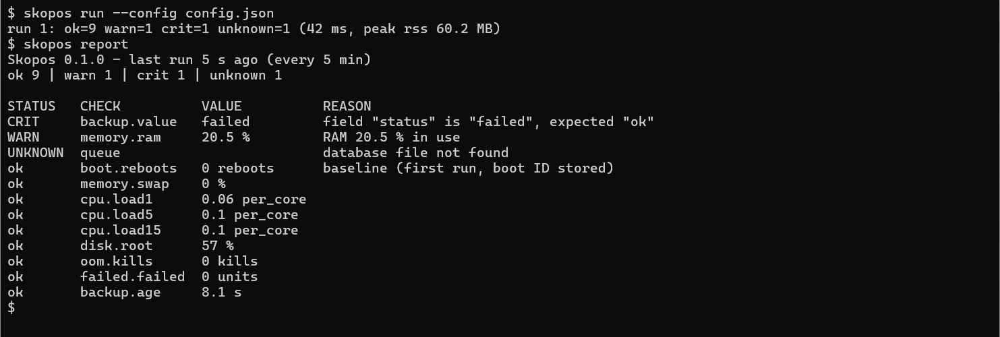
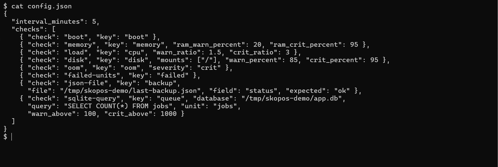
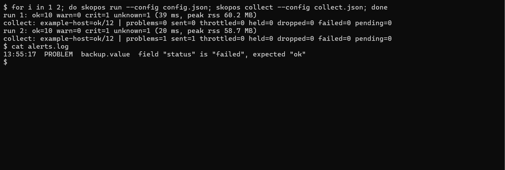
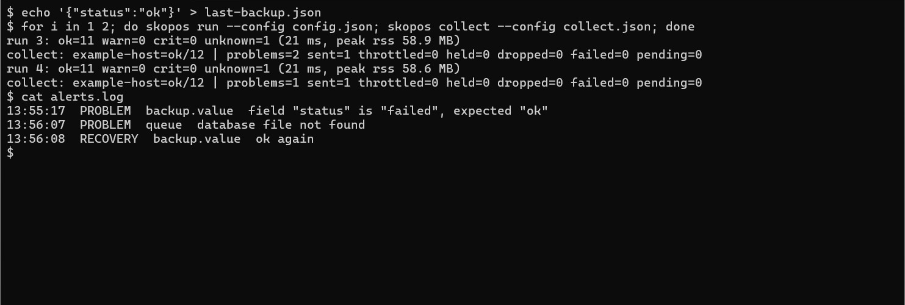

# Skopos

**English** · [Deutsch](README.de.md)

A lean, generic monitor in Node.js. The same code runs on every machine; a local
configuration file decides what gets checked. Measurements go into a local SQLite database,
and an external collector pulls them over SSH and evaluates them.

> Status: work in progress, first trial installation. Core, system checks, generic
> business checks, the installer and the collector work.



The status is always a word (`CRIT`, `WARN`, `UNKNOWN`, `ok`), never only a colour. Problems
come first; a check that could not measure is `UNKNOWN` with its reason, never `ok`.

## Requirements

- Linux with systemd
- Node.js ≥ 22.13 (for unflagged `node:sqlite`)

## Quick start

Try it locally (no install, no `npm ci`):

```bash
bin/skopos.js run --config config/example.json --db /tmp/skopos.db
bin/skopos.js report --db /tmp/skopos.db      # readable table; add --json for the machine format
```

Install on the target host (a plain copy of files, a system user and a systemd timer;
repeatable, also for updates):

```bash
sudo bin/install.sh --config config/example.json
```

Details, update and uninstall: [doc/installation.md](doc/installation.md).

## How it differs from Netdata, Prometheus or Uptime Kuma

Those are monitoring platforms: a server or dashboard to run, agents or exporters to
install, alert rules to maintain. Skopos is deliberately smaller: one program per machine, a
local SQLite file, no web server and no UI of its own, and a JSON report that a script or an
agent pulls over SSH. It has no dependencies and runs on 2 cores and 2 GB RAM. If you want
dashboards and live graphs, those tools are the better choice; Skopos is for the case where
history, a strict machine-readable interface and a small footprint matter more. The
reasoning is in [doc/concept.md](doc/concept.md).

Documentation under `doc/` is bilingual: `<name>.md` is English, `<name>.de.md` German —
each side links to the other at the top.

## What is Skopos

Skopos (Greek for "lookout") measures and stores — nothing else. It does not intervene, does
not raise alarms itself, has no UI, and never sends data out on its own. Evaluation and
ticketing are the collector's job. The reasoning is in [doc/concept.md](doc/concept.md),
the decisions in [doc/decisions.md](doc/decisions.md).

## Principles

1. Read only, never intervene.
2. Pull, not push.
3. "Unknown" is not "ok": what cannot be measured is stored as `unknown` with a reason.
4. Fail loudly: every run writes a heartbeat; missing fresh data is a finding in itself.
5. Generic core, host differences only in configuration.
6. Checks are small, tested modules.
7. Stay lean: no dashboard, no alerting, no web server, bounded retention.
8. Zero dependencies: SQLite via the built-in `node:sqlite`.

## Configuration

One JSON file per machine (default `/etc/skopos/config.json`, or `--config`), validated
strictly: an unknown check, unknown key or missing required value aborts loudly. See
[config/example.json](config/example.json) and [doc/core.md](doc/core.md).
Configuration recipes by monitoring goal (RAM/CPU, reboot detection, a metric from a
database or a JSON file, …): [doc/examples.md](doc/examples.md).



## Report format

The collector runs `skopos report --json [--since <ISO timestamp>]` over SSH and gets the
heartbeat, the current status per check and the history. The database schema stays internal
and may change; the report is the interface. Details: [doc/core.md](doc/core.md).

## Collector

`skopos collect --config <file>` is the collector, shipped with the same code. One host polls
the others every few minutes (user timer in `systemd/user/`) and keeps a small state machine:
a problem counts only after several runs in a row (soft/hard state), recoveries are
confirmed the same way, checks of an unreachable host are held back, flapping becomes one
"unstable" event, and notifications per hour are capped. Only confirmed state changes leave
the collector, as JSON on stdin of a command you configure (ticket, mail, chat — your
choice). A quiet poll calls nothing. Example:
[config/example-collect.json](config/example-collect.json), details:
[doc/collector.md](doc/collector.md).

A problem is reported only once it is confirmed. After the first run `problems=0` and
nothing is sent; after the second, the failed backup is a confirmed problem and one
notification goes out (here appended to a log file):



Recovery is confirmed the same way. Once the backup status is fine again, the same two
runs end with a `RECOVERY` line:



## License

[Apache License 2.0](LICENSE).

## Related projects

Skopos was built as an operator tool next to Agora (ticketing and delegation), FORGE and
Talos (agent host) — none of them public projects yet, so no links here.
